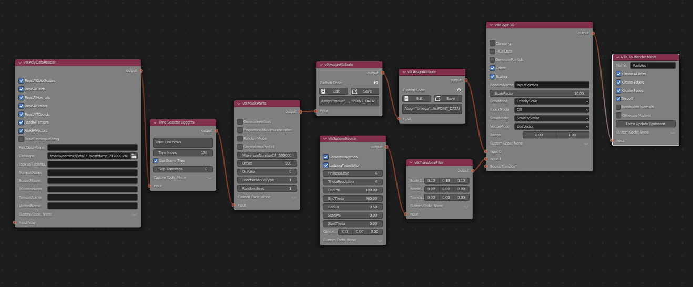

# BVTKNodes
    

**This version has a changed time selector for LIGGGHTS simulations.** Install natsort and vtk in the local blender-python!! See instructions [here](https://github.com/tkeskita/BVtkNodes/blob/master/pip_install_vtk.md).
Follow installation instructions in the [Docs](https://bvtknodes.readthedocs.io/en/latest/BVTKNodes.html#installation-of-vtk-for-blender:~:text=for%20Linux.-,Installation,-Install%20Blender%20(if). Also follow the [Workspace setup](https://bvtknodes.readthedocs.io/en/latest/BVTKNodes.html#installation-of-vtk-for-blender:~:text=Installation%20Instructions%20above.-,Workspace%20Setup,-BVTKNodes%20is%20used)
## Example use with Liggghts
- make a vtk folder and copy all vtk files that you want to visualize in it
- each folder contains only one "type" of vtk files. so if you have vtks with geometry data, put them into a separate folder (this is currently a bug, see [customfilter.py](customfilter.py) @line 336)
- then set up the nodes as seen below

you can apply automatic updates in the "inspect" panel on the right side of the BVTK-nodes window.

Have fun!!

## Forked README:

BVTKNodes is a Blender add-on that wraps the Visualization Toolkit (VTK) library for scientific visualization in Blender.
The high-level features of this add-on include:

- Node system for developing VTK pipelines
- Converters from VTK data to Blender meshes, particles and volumes
- Common scientific color maps

BVTKNodes can be used with Blender's powerful 3D modeling and rendering tools to make figures that are both informative as well as visually stunning.
This fork builds on the [original repository](https://github.com/simboden/BVtkNodes). Aim is to provide continued updates to newer Blender/VTK versions, new features, bug fixes and community involvement.

[**Docs**](https://bvtknodes.readthedocs.io/en/latest/) | [**Install Guide**](https://bvtknodes.readthedocs.io/en/latest/BVTKNodes.html#installation-of-vtk-for-blender) | [**Examples**](https://bvtknodes.readthedocs.io/en/latest/BVTKNodes.html#simple-example-human-head-visualization) | [**Gallery**](https://blenderartists.org/t/bvtknodes-gallery/1161079)

### Dependencies
- [Blender LTS version 2.93 (2.83 also still works)](https://www.blender.org/download/lts/)
- [VTK library version 9.1.0](https://pypi.org/project/vtk/9.1.0/)

### Quick Start
- Download the BVTKNode repository add-on as a .zip file.
- Start Blender, go to “Edit” –> “Preferences” –> “Add-ons” –> “Install” –> open the add-on zip file.
- Activate the “BVTKNodes” add-on in Preferences by clicking on the checkbox. Add-on is located in Node category, “Community” level of Blender add-ons.

See the [installation guide](https://bvtknodes.readthedocs.io/en/latest/BVTKNodes.html#installation-of-vtk-for-blender) for more details.

## More About BVTKNodes
[The Visualization Toolkit (VTK)](https://www.vtk.org/) is an open source library for scientific data processing and visualization.
BVTKNodes is an add-on for [Blender](https://www.blender.org/), a free and open source 3D creation suite.
This add-on makes it possible to create and execute VTK pipelines configured in Blender Node Editor, to produce surface mesh objects, which can be then modified and visualized in Blender.
While 3D visualization software such as [Paraview](https://www.paraview.org/) exist for scientific applications, BVTKNodes provides access to Blender's high quality and photorealistic rendering and mesh editing tools.
The original add-on was first presented at [Blender Conference 2018](https://www.youtube.com/watch?v=KcF4LBTTyvk).

##  Contributing
- Pull Requests: New features and bug fixes are welcome!
- GitHub Issues: Bug reports, new feature ideas, install issues, thoughts, etc. Please check the [docs](https://bvtknodes.readthedocs.io/en/latest/BVTKNodes.html#help-with-issues) first.

List of contributors can be found in [CONTRIBUTORS.md](https://github.com/tkeskita/BVtkNodes/blob/master/CONTRIBUTORS.md).
